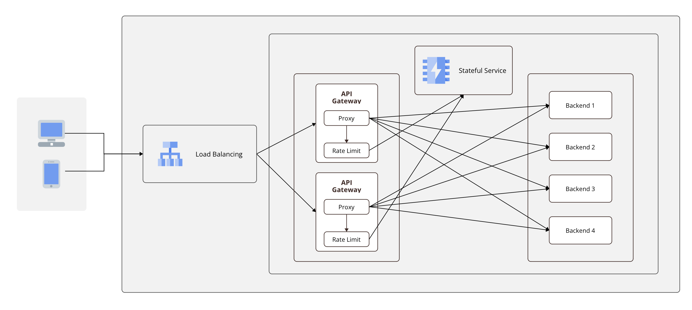

# Test Submission

This repo is the submission of Nguyen Tran Nguyen for Teko Hiring Test - Site Reliability Engineer

## Problem 1

The task at hand is to implement a sliding window rate limiter based on the given example input and output. This module should limit the number of requests to a specified rate per hour. Any requests exceeding this limit should be denied. Only the requests that are accepted are considered when counting the number of entries within a given time window.

The initial strategy is to utilize a queue to record accepted requests. When receiving new request, we remove any requests from the queue that are older than the time window. If the queue is not full after this removal process, the new request should be accepted.

In the given solution, where 'k' represents the rate of requests per window, the time complexity is O(k^2) and the space complexity is O(k). To enhance the module's performance, we should utilize a double-ended queue, which has O(1) complexity for both enqueue and dequeue operations. This adjustment should reduce the overall time complexity to O(k), without increasing the space complexity.

## Problem 2

In a cluster deployment, each API Gateway should be designed to be stateless and ephemeral, enabling easy scalability. The system's state will be maintained in a stateful service. In this specific context, in memory key-value stores emerge as the most appropriate choices. The keys represent the identity of each user, such as an API key or IP address, while the values track the history of user visits. Whenever a new request arrives, we retrieve the system's current state from the stateful service and subsequently commit the updated state back. The specific choice of key-value store varies based on many factors such as exsiting services, cloud provider, developer preferences, but some examples are Redis, Memcached, GCP Memorystore or AWS Memcached, etc.

In addition, a load balancer serivce should stands before and encapsulate the API Gateway cluster so the scaling in and out of the instances does not affect clients. The load balancer provides a consistent entry point to the system and automatically discovers and distributes requests among API Gateway instances.

The proposed architecture is presented in the diagram below.

